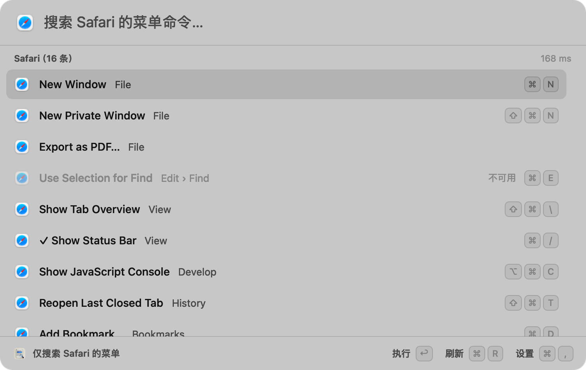
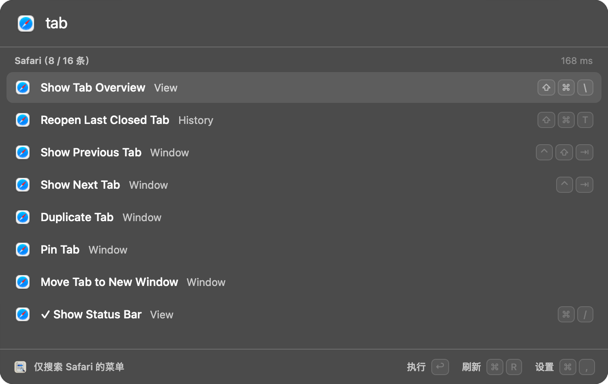

# MenuSearch

[中文](README.md) | **English**

Press one shortcut in any app to list **every command in that app's menu bar and submenus**; type to filter, ↑↓ to select, Return to run, Esc to close. It does what Raycast's Search Menu Items does, as a standalone native macOS app: no Raycast, Karabiner or skhd required. Open source under the MIT license.

[Product page and demo](https://app-mac-menusearch.tianli.cyou/) (Chinese) · [Download the latest release](https://github.com/zengtianli/MenuSearch/releases/latest) · [Report an issue](https://github.com/zengtianli/MenuSearch/issues)





These are the app's real views rendered in the background; the list is fixed demo menu data, not the menus of any actual Mac.

## Download and install

Requires **Apple Silicon (M1 or later) and macOS 14 or later**. There is no Intel build. The interface is in Chinese.

1. Download `MenuSearch-<version>-arm64.dmg` from [Releases](https://github.com/zengtianli/MenuSearch/releases/latest).
2. Open the DMG and drag `MenuSearch.app` to `Applications`.
3. Open MenuSearch from Applications and follow "First run" below to grant the permission and record a shortcut.

A ZIP is provided as well; unzip it and move the app to Applications. Release packages are signed with a Developer ID under the hardened runtime and notarized by Apple; each release carries its SHA-256 values in `SHA256SUMS` and `release.json`.

To use the same features from a terminal, add a command link (optional):

```sh
mkdir -p ~/.local/bin && ln -s /Applications/MenuSearch.app/Contents/MacOS/MenuSearch ~/.local/bin/menusearch
```

Updating: click 检查更新 (Check for updates) in the settings window, or run `menusearch update --install`. The new version is downloaded, its checksum, signature and notarization are verified, and only then does it replace the old one; configuration and shortcut are kept, and the previous copy stays in `~/Library/Application Support/TianliApps/UpgradeBackups/`.

Uninstalling: quit MenuSearch, then delete `/Applications/MenuSearch.app`, `~/.local/bin/menusearch` and `~/Library/Application Support/cyou.tianli.menusearch/`.

## First run

1. Open `/Applications/MenuSearch.app`. The settings window appears.
2. Under 权限 (Permissions) click 打开系统设置…, then enable MenuSearch in Privacy & Security › Accessibility. Reading and running another app's menus needs this permission; MenuSearch never grants it for you.
3. Under 快捷键 (Shortcut) click the button and press the combination you want (it needs ⌘, ⌃ or ⌥; Esc cancels). Nothing is registered by default and none of your existing keys is taken.
4. Close the settings window. From then on press the combination in any app.

Open MenuSearch again (or run `menusearch settings`, or press ⌘, in the panel) to return to the settings window. The interface is in Chinese.

## Two ways to summon

| Mode | Who owns the shortcut | Process |
| --- | --- | --- |
| Built-in shortcut (default) | MenuSearch registers the one combination you recorded with the system | Keeps running as an ordinary, visible app: it is in the Dock, the ⌘Tab switcher and the menu bar. Closing the settings window or the panel does not quit it; quitting it does |
| External | skhd, Karabiner or another launcher runs `menusearch show` | Not resident; the process ends after the panel closes, registers no shortcut and never enters the Dock |

While it keeps running you can find it and quit it the usual ways: switch to it with ⌘Tab (with no window open this brings up the settings), click its Dock icon, or click the menu bar icon, whose menu has "Search the current app's menus", "Settings…" and "Quit". Quit with ⌘Q, the Dock menu, the menu bar icon, the button in the settings window or `menusearch quit`; the shortcut then stops responding until the app is opened again.

The two are mutually exclusive; switch in the settings window or with `menusearch config set mode builtin|external`. Switching stops the old shortcut source before starting the new one; if the new one cannot start (for example another app owns the combination) the previous mode comes back and the saved settings stay as they were.

For external mode, bind this one command in your key tool. MenuSearch never edits those tools' configuration:

```sh
/Applications/MenuSearch.app/Contents/MacOS/MenuSearch show    # or ~/.local/bin/menusearch show
```

Recording a shortcut checks three things: shortcuts macOS itself has enabled (refused), a refusal by the system (refused, the previous key stays), and the same combination declared in skhd's configuration or in `~/.config/mackit/keys.d` by another tool (read-only check, shown as a hint).

## The panel

| Key | Effect |
| --- | --- |
| Typing | Filters. Space-separated tokens, discontinuous characters (`exp pdf`), menu paths too (`view developer`) |
| ↑ ↓ | Select; focus stays in the field |
| ↩ | Run the selected command. While a Chinese input method is composing, Return still confirms the candidate |
| Esc, or clicking elsewhere | Close |
| ⌘R | Read the menu again |
| ⌘, | Open settings |

With nothing typed, every command is listed. Each row shows the full menu path, key equivalent, check mark and disabled state; disabled commands are never run. Every summon reads afresh; menu content is neither cached nor written to disk. If a read times out or a menu does not answer, the panel says the result is incomplete.

Before running, the app checks again that the target app is still frontmost, that the item still belongs to it, that its title is unchanged and that it is enabled; if any of these fails nothing is run and a refresh is suggested.

## Command line

The command and the app are one executable sharing the same settings and background instance. Add the link from "Download and install" above to call it as `menusearch` (`scripts/install.sh` adds it for you when installing from source).

| Command | Effect |
| --- | --- |
| `menusearch status [--json]` | Version, mode, shortcut, permissions, background instance state, timing of the latest summon. Read-only |
| `menusearch show` | Summon the panel for the current app; close it if it is showing |
| `menusearch scan [--pid PID] [--query TEXT] [--json]` | Read menu commands, read-only; `--query` uses the panel's own matching |
| `menusearch execute --pid PID --path-json '["View","Show Path Bar"]' [--json]` | Run the command whose full path matches exactly once; the target app must be frontmost |
| `menusearch settings` | Open the settings window |
| `menusearch config get｜set mode｜set hotkey｜set login｜export｜import｜path` | Read and change configuration, export, import |
| `menusearch config set icloud on\|off` | Keep the configuration in iCloud; the same switch as in the settings window |
| `menusearch update [--install] [--json]` | Ask GitHub for the latest published release; the network is used only when this command runs. `--install` has the app download and verify the package, upgrade and keep the configuration, and the start that follows shows no window |
| `menusearch quit` | Quit the background instance |
| `menusearch help`, `version` | Usage, version |

Exit codes: `0` success; `1` not completed (no permission, incomplete menu, target not frontmost, instance not answering…); `2` usage error. An unknown command is a usage error and never opens the panel. With `--json`, standard output is exactly one JSON object.

`scan` and `execute` read menus inside the command-line process, using the Accessibility permission of **the terminal or tool that called them**; `show` hands the work to MenuSearch.app, which uses the app's own permission. `status` reports both.

## Configuration, sync and updates

Settings live in `~/Library/Application Support/cyou.tianli.menusearch/settings.json` and hold two things: the mode and the shortcut. The settings window can export and import them and can turn on iCloud configuration sync (the system Apple ID's iCloud Drive, off by default). The Accessibility permission, login item, runtime state and menu content are never part of it. A damaged settings file is not silently overwritten: the app runs on defaults, says why, and keeps a copy of the original at the next save.

"检查更新" (Check for updates) asks GitHub for this repository's latest published release. It runs only when you click it (or run `menusearch update`): never in the background and not at launch.

The few values that follow macOS rather than this app (which top-level menus belong to the system, read time limits) ship in `tuning.json`; a file of the same name in the support directory overrides single keys without reinstalling.

## Privacy and network

- Menu content is read locally, used and dropped; nothing is written or uploaded. The app records only the item count and timing of the latest summon.
- The only network use is the update check: when you click 检查更新 or run `menusearch update`, the app requests this repository's latest release information from GitHub, and downloads the package from GitHub if you choose to upgrade. There is no automatic check, and the request carries no menu content or device information. Apart from that the app opens no network connection, and a running instance holds no internet socket (the acceptance checks include this).
- The optional iCloud configuration sync reads and writes iCloud Drive's local folder and leaves syncing to the system; it is off by default.
- The shortcut is one specific combination registered with the system. No keyboard monitoring, no key logging, no synthetic input.
- No account, no analytics.

<!-- lightweight:start -->
## Resource use

| Installed | Idle memory | Idle CPU | Speed |
|---|---|---|---|
| **2.1 MB** | **17.8 MB** | **0%** | **422 ms** |

<sub>v0.2.0 (6) · Mac16,12 / Apple M4 / macOS 27.2 · measured 2026-10-07. Measured on the listed device; re-measured for each version. Memory uses phys_footprint; CPU is CPU time ÷ wall time over a 60-second sampling window; sizes in decimal MB. Raw data: [perf/lightweight.json](perf/lightweight.json).</sub>
<!-- lightweight:end -->

The numbers above are written from the measurement file. Two more: filtering while typing in 1000 commands has a P95 of about 14–33 ms (rendered in the background, including list reload and layout, varying with machine load); reading one app's menu takes about 40–76 ms for Finder (201 items), 28–43 ms for WeChat (92), 149–206 ms for Chrome (750) and 307–536 ms for Safari (577, depending on its state). In external mode no process of this app remains after the panel closes. The time from pressing the shortcut to the complete list is recorded for every summon in `last_show` of `menusearch status`.

## What has been verified

| Layer | State |
| --- | --- |
| Logic tests and the background self-test (production panel, settings window, mode and shortcut transactions, control socket, configuration transfer) | Run on every build; a failure produces no app. Key guards were reverse-validated (breaking each makes the self-test fail) |
| Fixed acceptance checks: functionality / recovery / privacy / native_ui | Pass (isolated directory, nothing on screen): `python3 scripts/accept/run.py <check>` |
| Signature, notarization, reading the release packages back | Checked for every release by `scripts/release.py`: the app inside both the ZIP and the DMG passes Gatekeeper and matches the build record |
| In-app upgrade | Run for real on the author's Mac: configuration and shortcut kept, no window and no focus change afterwards |
| Reading real menus | All ten checklist queries found in Safari, Finder, WeChat and Chrome (read-only, from the command line) |
| Use on a real desktop | In daily use by the author. There is no item-by-item on-screen acceptance record; the screenshots here and on the product page are background renders of demo data |

Known limits: Apple Silicon only; the interface is Chinese only; some apps' menus can be read completely only once the app answers, and the panel says so when a result is incomplete; when the menu bar icon does not fit next to the notch the system hides it, and the app is still reachable from the Dock and ⌘Tab.

## Building from source

An Apple Silicon Mac with Xcode or the Command Line Tools; no third-party dependencies.

```sh
bash build.sh                 # logic tests → build and sign → background self-test; a failure never replaces build/MenuSearch.app
bash build.sh --test-only     # logic tests only
python3 scripts/accept/run.py functionality   # also recovery, privacy, native_ui
bash scripts/install.sh [--restart]            # install to /Applications and link the command; the previous copy goes to the Trash
```

The signing identity is `CODESIGN_IDENTITY`, else the first line of `local/signing-identity`, else ad-hoc. An ad-hoc build works, but macOS asks for the Accessibility permission again after every rebuild, and the in-app upgrade only accepts a package signed by the same developer as the installed copy; a stable identity keeps the permission.

Rolling back a copy installed with `scripts/install.sh`: the previous one is in `~/.Trash/menusearch-<version>-<time>/MenuSearch.app`; move it back to `/Applications`. Settings are unaffected.

## Feedback

Please open an [issue](https://github.com/zengtianli/MenuSearch/issues). The macOS version, which app's menus are involved and the output of `menusearch status` (it contains no menu content) help a lot.

## Origin and license

MIT, see [LICENSE](LICENSE). Menu reading, filtering, panel interaction and the execution guards were moved out of the menu-search prototype in [MacKit](https://github.com/zengtianli/mackit) (same author, MIT). Behaviour follows [Raycast's public description](https://manual.raycast.com/navigation); no code from Raycast or any third-party extension was copied. The settings and update window uses source files shared across the author's apps (`Sources/AppLifecycle*.swift`, `AppConfiguration.swift`, `LaneSignal.swift`), provided here under the same license.
